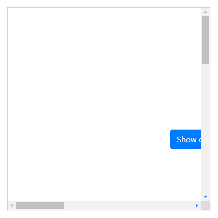

# easyest-dropdown

`easyest-dropdown`是一个可智能定位的最基础的下拉组件，你可以用它实现任何带有下拉功能的组件，如自定义select、日期时间选择器、多级菜单、自动填充输入框等。

`easyest-dropdown`的智能定位体现在：
1. 当下拉弹窗无法完全显示在浏览器视口或滚动容器可视区域时会自动调整到最佳显示位置。
2. 下拉弹窗优先使用`right`、`bottom`定位，这样可以保证下弹窗显示后动态修改下拉弹窗宽高后下拉弹窗显示位置依旧正常

`easyest-dropdown`没有任何外部依赖，因此您可以在`原生JavaScript`、`vue`、`react`、`angular`等项目中使用它。

**效果图：**



## 安装
1. 使用`npm`安装
```bash
npm install easyest-dropdown -S
```
[文档及Demo](https://941477276.github.io/easyest-dropdown/doc-dist/)

## 使用
### 1. 传统项目
如果您的项目是传统项目，您需要将`dist/easyest-dropdown.js`文件下载下来并放到您项目中，然后通过浏览器`<script>`标签引入`easyest-dropdown.js`。
```html
<head>
  <!--如果您不使用easyest-dropdown自带的css，那么您可以不导入它-->
  <!--<link rel="stylesheet" href="./easyest-dropdown.css">-->
  <script src="./easyest-dropdown.js"></script>
</head>

<body>
    <button type="button" class="btn btn-primary" id="referenceEl">Show custom dropdown</button>
    
    <ul id="dropdownEl" class="my-custom-dropdown easyest-dropdown-transition">
      <li>Html</li>
      <li>Javascript</li>
      <li>Css</li>
      <li>Vue <small>(渐进式JavaScript框架)</small></li>
      <li>React <small>(构建Web和原生交互界面的库)</small></li>
      <li>Angular <small>(一个应用设计框架与开发平台)</small></li>
    </ul>
    <script>
      var referenceEl = document.getElementById('referenceEl');
      var dropdownEl = document.getElementById('dropdownEl');
      var isShow = false;
      referenceEl.addEventListener('click', function () {
        if (isShow) {
          dropdownEl.style.display = 'none';
          isShow = false;
          return;
        }
        var dropdownPosition = easyestDropdown.getDropdownDirection(referenceEl, dropdownEl, 'bottom', true);
        console.log('dropdownPosition', dropdownPosition);
        dropdownEl.style.left = dropdownPosition.right == null ? (dropdownPosition.left + 'px') : 'auto';
        dropdownEl.style.right = dropdownPosition.right != null ? (dropdownPosition.right + 'px') : '';
        dropdownEl.style.top = dropdownPosition.bottom == null ? (dropdownPosition.top + 'px') : 'auto';
        dropdownEl.style.bottom = dropdownPosition.bottom != null ? (dropdownPosition.bottom + 'px') : '';
        dropdownEl.style.display = 'block';
        var classNameArr = dropdownEl.className.split(' ');
        var placementClassName = classNameArr.find(function (className) {
          return className.startsWith('easyest-placement-');
        });
        if (placementClassName) {
          dropdownEl.classList.remove(placementClassName);
        }
        dropdownEl.classList.add('easyest-placement-' + easyestDropdown.camelCase2KebabCase(dropdownPosition.direction));
        isShow = true;
      }, false);
    </script>
</body>
```

### 2. vue3
**方式一：全局注册**(main.js)
```js
import { createApp } from 'vue';
import EasyestDropdownTransition from 'easyest-dropdown/vue3/es';
import 'easyest-dropdown/vu3/es/easyest-dropdown.css';


const app = createApp(...);
app.use(EasyestDropdownTransition);
app.mount('#app');
```

**方式二：局部注册**
```js
import EasyestDropdownTransition from 'easyest-dropdown/es';
import 'easyest-dropdown/vue3/es/easyest-dropdown.css';

export default defineComponent({
  name: 'ATestComponent',
  components: {
    EasyestDropdownTransition
  }
});
```

**使用：**
```html
<template>
  <bs-button ref="referenceRef" type="primary" @click="showDropdown">{{ show ? 'Hide' : 'Show' }} custom dropdown</bs-button>
  <bs-button type="primary" @click="allowTeleport = true">Teleport to body</bs-button>

  <teleport :disabled="!allowTeleport" to="body">
    <easyest-dropdown-transition
      :will-visible="willVisible"
      :reference-ref="referenceRef">
      <ul
        ref="dropdownRef"
        v-show="show"
        class="my-custom-dropdown">
        <li>Html</li>
        <li>Javascript</li>
        <li>Css</li>
        <li>Vue <small>(渐进式JavaScript框架)</small></li>
        <li>React <small>(构建Web和原生交互界面的库)</small></li>
        <li>Angular <small>(一个应用设计框架与开发平台)</small></li>
      </ul>
    </easyest-dropdown-transition>
  </teleport>
</template>

<script>
  import EasyestDropdownTransition from 'easyest-dropdown/vue3/es';
  import 'easyest-dropdown/vue3/es/easyest-dropdown.css';

  export default defineComponent({
    name: 'ATestComponent',
    components: {
      EasyestDropdownTransition
    },
    setup () {
      let willVisible = ref(false);
      let show = ref(false);
      let allowTeleport = ref(false);

      let referenceRef = ref();
      let dropdownRef = ref();
      let showDropdown = function () {
        // willVisible必须比show先行，这样才能确保<easyest-dropdown-transition>组件正确的计算过渡动画名称
        willVisible.value = !willVisible.value;
        let timer = setTimeout(function () {
          clearTimeout(timer);
          show.value = !show.value;
        }, 60);
      };

      // 鼠标点击下拉菜单外面后立即隐藏下拉菜单
      useClickOutside([referenceRef, dropdownRef], function (isClickOutside) {
        if (isClickOutside) {
          show.value = false;
          willVisible.value = false;
        }
      });
      return {
        willVisible,
        show,
        allowTeleport,
        referenceRef,
        dropdownRef,
        showDropdown
      };
    }
  });
</script>

<style lang="scss" scoped>
.my-custom-dropdown{
   position: absolute;
   padding: 0;
   z-index: 999;
   border: 1px solid #f0f0f0;
   background-color: #fff;
   box-shadow: 0 0 8px rgba(0,0,0,0.1);
   list-style: none;
   li{
      height: 2rem;
      line-height: 2rem;
      padding: 0 1rem;
      border-bottom: 1px solid #f0f0f0;
      cursor: pointer;
      transition: all .3s;
      &:last-child{
        border-bottom: 0;
      }
      &:hover{
        color: #fff;
        background-color: var(--primary);
      }
   }
}
.bs-button {
   margin: 0 1rem 1rem 0;
}
</style>
```

3. 模块化开发

    如果您使用的模块化开发模式（适用`vue`、`react`、`angular`、），您需要导入easyest-dropdown，然后再像传统模式一样使用即可：

```javascript
import easyDropdown from 'easyest-dropdown';
// 如果您不使用easyest-dropdown自带的css，那么您可以不导入它
// import 'easyest-dropdown/dist/easyest-dropdown.css';

var dropdownPosition = easyDropdown.getDropdownDirection(referenceEl, dropdownEl, 'bottom', true);
console.log('dropdownPosition', dropdownPosition);
```
